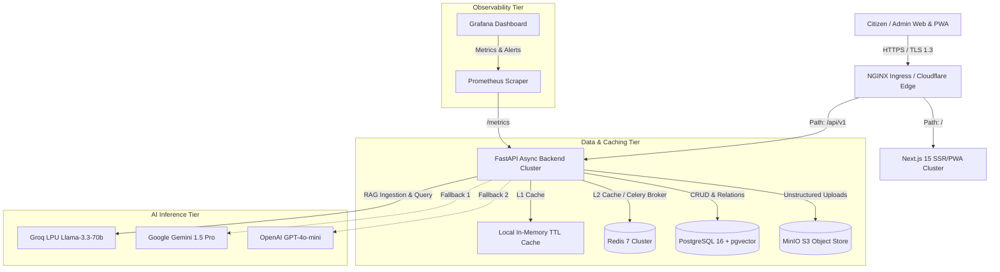

# WasteCare Enterprise Platform — System Architecture & Topology

## 1. System Overview
WasteCare is an enterprise-grade, multi-tenant municipal SaaS platform designed for civic municipal corporations, state pollution control boards, and smart cities. The platform provides:
- **Citizen Experience & PWA**: Offline-resilient progressive web application for locating waste disposal points, reporting civic sanitation issues, and receiving policy guidance.
- **Municipal Control Plane**: Real-time dispatching, regional hierarchy tracking (Tenants → Regions → Zones → Wards), and IoT smart bin telemetry.
- **AI RAG Policy Engine**: Grounded retrieval-augmented generation powered by Groq LPUs (`llama-3.3-70b-versatile`) with multi-provider fallback.
- **GIS Intelligence**: Haversine/Euclidean proximity ranking, spatial density heatmap generation, and geofencing.

---

## 2. Component Architecture Diagram

---

## 3. High-Throughput Request Lifecycle

1. **Edge Routing**: Incoming requests hit NGINX Ingress which terminates TLS 1.3, enforces rate limits (100 req/sec per IP), and injects `X-Request-ID` and `X-Forwarded-For`.
2. **Tenant Resolution**: The `TenantMiddleware` examines `X-Tenant-ID` header or hostname subdomain, validating the tenant against the active database or cached tenant registry.
3. **Authentication & RBAC**: PyJWT bearer tokens are verified. The `PermissionChecker` verifies that the actor holds the required granular capability (e.g. `report.dispatch` or `location.write`).
4. **Multi-Tier Caching**:
   - Facility queries first check the L1 in-memory LRU cache (< 1ms).
   - If missing, check L2 Redis cache (1-3ms).
   - On cache miss, execute indexed PostgreSQL query, serialize response, and backfill L1 and L2 caches.
5. **Observability**: Execution duration and response status are recorded in Prometheus latency histograms.

---

## 4. Hardware & Scaling Profiles

| Service | Min Pods | Max Pods | CPU Request/Limit | Memory Request/Limit | Target Metric |
|---|---|---|---|---|---|
| **Backend API** | 3 | 20 | 250m / 1000m | 512Mi / 1536Mi | CPU > 70%, Latency > 300ms |
| **Frontend UI** | 3 | 15 | 150m / 500m | 256Mi / 768Mi | CPU > 70% |
| **Postgres DB** | 1 (Primary) + 1 (Replica) | StatefulSet | 1000m / 4000m | 2048Mi / 8192Mi | Storage PVC 500Gi |
| **Redis** | 1 (Master) + 2 (Sentinels) | StatefulSet | 250m / 1000m | 512Mi / 2048Mi | Maxmemory LRU |
