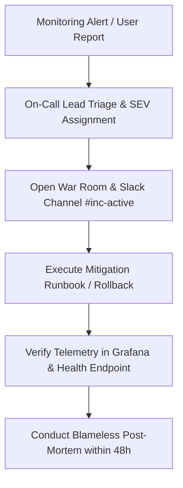

# Incident Response Plan & Escalation Matrix

## 1. Severity Classification

| Level | Severity | Criteria | Target Response | Target Resolution |
|---|---|---|---|---|
| **SEV-1** | Critical Outage | Entire platform unavailable, database corruption, active security breach | **< 15 minutes** | **< 2 hours** |
| **SEV-2** | Major Degradation | AI RAG pipeline failing, facility search unavailable, civic complaint submissions failing | **< 30 minutes** | **< 4 hours** |
| **SEV-3** | Minor Impairment | Slow non-critical dashboard queries, minor styling issues, single sensor offline | **< 2 hours** | **< 24 hours** |
| **SEV-4** | Low / Cosmetic | Documentation typo, non-urgent feature request | **< 1 business day**| Next sprint |

---

## 2. Incident Response Workflow



---

## 3. Communication Protocol

1. **Stakeholder Notifications**: Send status updates every 30 minutes for SEV-1 incidents via the status page (`status.wastecare.gov`).
2. **Escalation Roles**:
   - **Incident Commander (IC)**: Directs investigation and mitigation decisions.
   - **Technical Lead (TL)**: Executes diagnostic runbooks and patches.
   - **Communications Lead (CL)**: Informs municipal commissioners and public relations.

---

## 4. Rollback Procedures

### Instant Image Rollback:
```bash
# Roll back backend deployment to previous revision
kubectl rollout undo deployment/wastecare-backend -n wastecare-production

# Check rollout status
kubectl rollout status deployment/wastecare-backend -n wastecare-production
```
