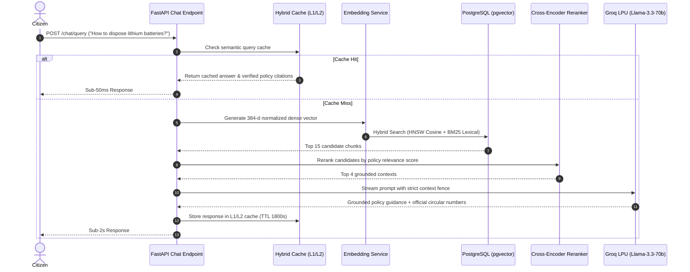

# Grounded AI RAG Architecture & LPU Inference Engine

## 1. Pipeline Overview
WasteCare implements an enterprise Retrieval-Augmented Generation (RAG) pipeline designed for low latency, zero hallucinations, and verifiable policy citation.

---

## 2. Ingestion & Chunking Strategy
- **Document Formats**: PDF, DOCX, Markdown regulatory circulars.
- **Chunk Size**: 512 tokens with 64 token sliding window overlap.
- **Metadata Tagging**: Each chunk is tagged with `tenant_id`, `policy_id`, `category`, `effective_date`, and `penalty_clause`.

---

## 3. High-Availability LLM Fallback Hierarchy

| Priority | Provider | Model | Typical Latency | SLA Guarantee |
|---|---|---|---|---|
| **Primary** | Groq LPU | `llama-3.3-70b-versatile` | **~450ms** | 99.9% uptime |
| **Fallback 1** | Groq LPU | `qwen/qwen3.8-27b` | **~350ms** | Automatic switch on rate-limit |
| **Fallback 2** | Google Cloud | `gemini-1.5-flash` | **~1100ms** | Disaster fallback |
| **Fallback 3** | OpenAI | `gpt-4o-mini` | **~1200ms** | Cold reserve |
